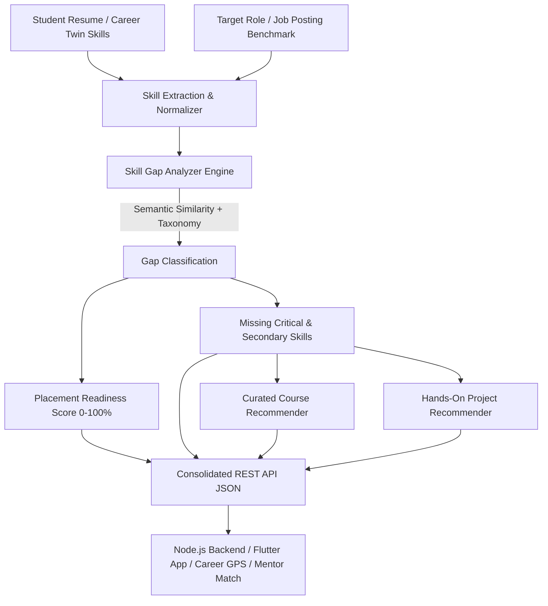

# 🎯 EduBridge AI — Skill Gap Analyzer Model & Microservice

> **Smart India Hackathon 2026 (SIH 2026)**  
> **Problem Statement ID**: `SIH26135`  
> **Title**: Difficulties in tracking employment outcomes, skill gaps, and the impact of skilling initiatives  
> **Theme**: Smart Education | **Team**: Sight Flub  

---

## 📌 Overview

The **Skill Gap Analyzer** is one of the 4 core AI engines powering the **EduBridge AI** platform:

1. 🧠 **Career Twin Engine**: NLP + Embeddings $\rightarrow$ Career score & skill profile extraction.
2. 🤝 **Mentor Match Engine**: SBERT / Cosine Similarity $\rightarrow$ Best alumni mentors.
3. 🗺️ **Career GPS Engine**: LLM + Rule-based Recommendation $\rightarrow$ Personalized career roadmap.
4. 📊 **Skill Gap Analyzer (This Module)**: Classification & Similarity Model $\rightarrow$ **Detects missing skills, computes Placement Readiness (0-100%), and recommends targeted courses & portfolio projects.**



---

## 🚀 Key Features

- **Standardized Technical Taxonomy & Synonyms**: Resolves variations (e.g., `react.js` $\rightarrow$ `React`, `k8s` $\rightarrow$ `Kubernetes`, `py` $\rightarrow$ `Python`, `dsa` $\rightarrow$ `Data Structures & Algorithms`).
- **Pre-Configured Industry Benchmarks**: Full Stack Developer, AI/ML Engineer, Data Scientist, Cloud DevOps Engineer, Backend Engineer, Frontend Engineer, Mobile Developer (Flutter), Cybersecurity Analyst.
- **Dynamic Job Description (JD) Parsing**: Upload or paste any raw job posting text; the engine extracts requirements and computes gaps.
- **Weighted Placement Readiness Scoring**: Multi-domain readiness index calculation with category breakdowns (Languages, Frontend, Backend, Databases, Cloud/DevOps, CS Fundamentals).
- **Curated Course Recommender**: Directly maps missing skills to top courses from Coursera, NPTEL (IITs), Udemy, edX, and YouTube.
- **Hands-On Portfolio Project Recommender**: Suggests real-world projects bridging specific missing skills with estimated hours, key features, and GitHub architecture guides.
- **RESTful FastAPI Microservice**: Full CORS support and Swagger docs ready to connect with Flutter mobile app and Node.js backend.
- **Built-in Interactive Web UI**: Test live skill profiles at `http://localhost:8000/demo`.

---

## 🛠️ Project Structure

```
alumini_skill/
│
├── skill_gap_analyzer/           # Core Python AI Package
│   ├── __init__.py               # Package exports
│   ├── models.py                 # Pydantic schemas (Request/Response)
│   ├── taxonomy.py               # Skill ontology, aliases & text extractor
│   ├── benchmarks.py             # Role benchmarks & category weightings
│   ├── recommender.py            # Course & Project recommendation engines
│   └── analyzer.py               # Core Gap & Placement Readiness engine
│
├── web/
│   └── index.html                # Modern interactive testing dashboard
│
├── examples/
│   ├── integration_example.js    # Node.js / Express backend integration
│   └── integration_example.py    # Python multi-engine pipeline demo
│
├── tests/
│   └── test_analyzer.py          # Pytest unit & integration test suite
│
├── main.py                       # FastAPI API server
├── requirements.txt              # Dependencies
└── README.md                     # Documentation
```

---

## ⚡ Quick Start

### 1. Install Dependencies
```bash
pip install -r requirements.txt
```

### 2. Start the API Server & Interactive UI
```bash
python main.py
```
- **Interactive Web UI**: [http://localhost:8000/demo](http://localhost:8000/demo) or [http://localhost:8000](http://localhost:8000)
- **Interactive Swagger API Docs**: [http://localhost:8000/docs](http://localhost:8000/docs)

### 3. Run Automated Tests
```bash
pytest tests/
```

---

## 🔌 API Endpoints Reference

### 1. Analyze Student Skills Against Target Role
`POST /api/v1/skill-gap/analyze`

**Request Body:**
```json
{
  "student_name": "Rahul Sharma",
  "student_skills": ["JavaScript", "HTML5", "CSS3", "Python", "Git"],
  "target_role": "Full Stack Web Developer",
  "experience_level": "Entry Level"
}
```

**Response Body (Excerpt):**
```json
{
  "student_name": "Rahul Sharma",
  "target_role": "Full Stack Web Developer",
  "placement_readiness_score": 62.5,
  "readiness_level": "Near Ready (Minor Upskilling Needed)",
  "matched_skills_count": 5,
  "missing_skills_count": 8,
  "matched_skills": [
    { "skill_name": "JavaScript", "status": "Matched", "similarity_score": 1.0 }
  ],
  "missing_critical_skills": [
    { "skill_name": "React", "category": "Frontend Development", "importance": "Critical" },
    { "skill_name": "Node.js", "category": "Backend & APIs", "importance": "Critical" },
    { "skill_name": "MongoDB", "category": "Databases & Caching", "importance": "Critical" }
  ],
  "recommended_courses": [
    {
      "skill": "React",
      "title": "Full Stack Open: Modern Web Development (React & Node)",
      "provider": "University of Helsinki",
      "rating": 4.9,
      "url": "https://fullstackopen.com/en/",
      "is_free": true
    }
  ],
  "recommended_projects": [
    {
      "title": "Full-Stack Microservices E-Commerce & Inventory Platform",
      "difficulty": "Advanced",
      "estimated_hours": 35,
      "missing_skills_covered": ["React", "Node.js", "MongoDB", "Docker"]
    }
  ],
  "action_plan": [
    "📊 Your current Placement Readiness Score is 62.5% for Full Stack Web Developer.",
    "🚀 High Priority: Master top critical missing skills first: React, Node.js, MongoDB using the recommended courses.",
    "🛠️ Hands-On Skilling: Complete project 'Full-Stack Microservices E-Commerce & Inventory Platform' to showcase on GitHub.",
    "🤝 Connect with an Alumni Mentor in your target domain via EduBridge Mentor Match."
  ]
}
```

---

## 🔗 Multi-Module Integration (EduBridge AI Pipeline)

### Node.js / Express Backend
```javascript
const axios = require('axios');

async function getSkillGaps(studentSkills, targetRole) {
  const res = await axios.post('http://localhost:8000/api/v1/skill-gap/analyze', {
    student_skills: studentSkills,
    target_role: targetRole
  });
  return res.data;
}
```

### Python Integration with Other Engines
```python
from skill_gap_analyzer import SkillGapAnalyzer, SkillGapRequest

analyzer = SkillGapAnalyzer()
result = analyzer.analyze(SkillGapRequest(
    student_name="Ananya",
    student_skills=["Python", "SQL", "Pandas"],
    target_role="AI & Machine Learning Engineer"
))

# 1. Pass result.placement_readiness_score to Placement Readiness Dashboard
# 2. Pass result.missing_critical_skills to Mentor Match Engine to find alumni tutors
# 3. Pass result.action_plan to Career GPS Engine for weekly roadmap generation
```
